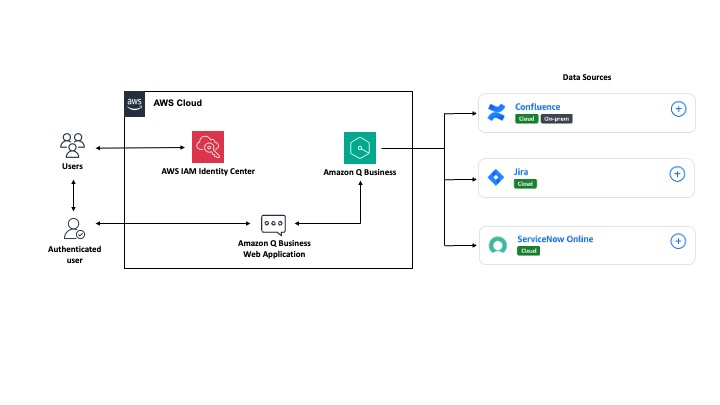
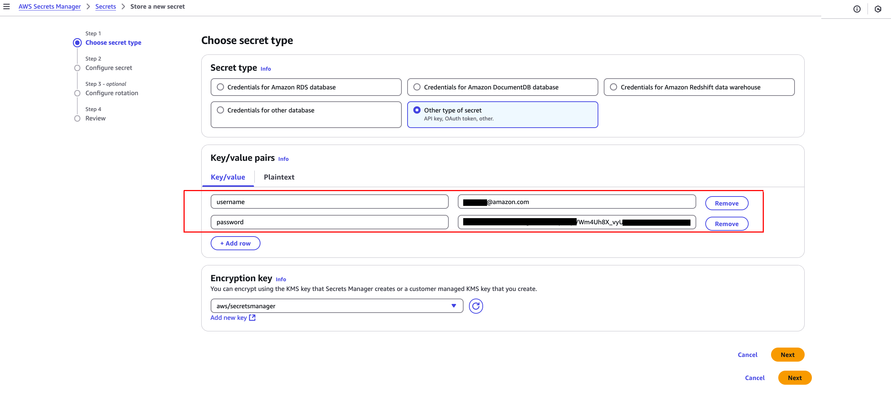
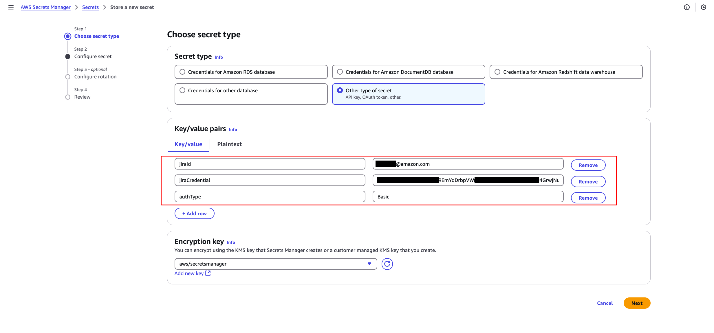
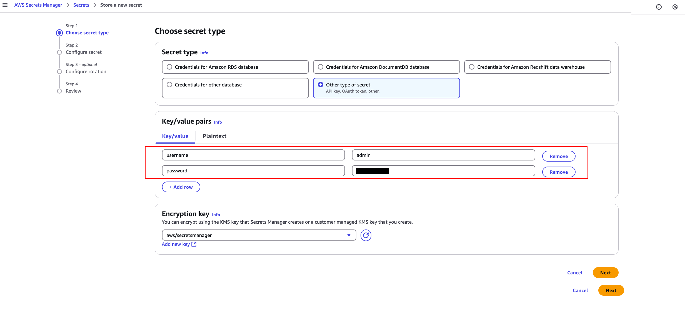
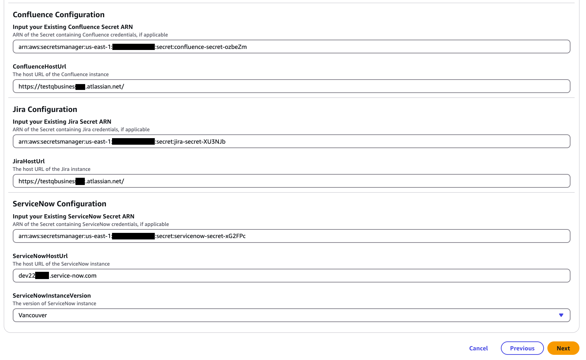
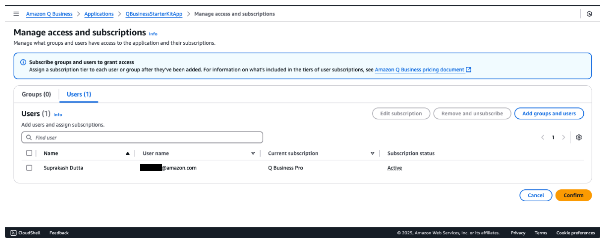
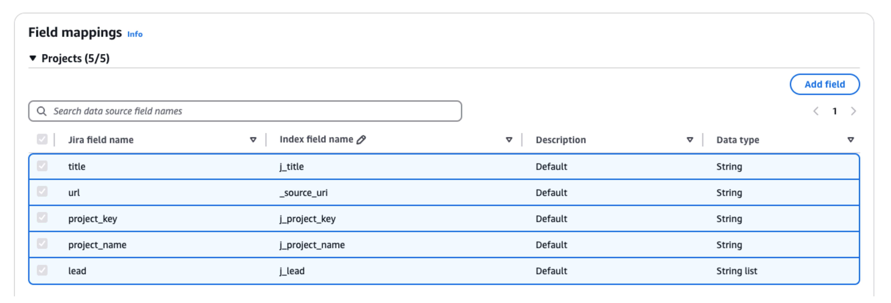
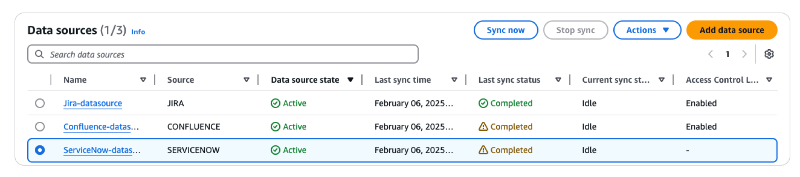
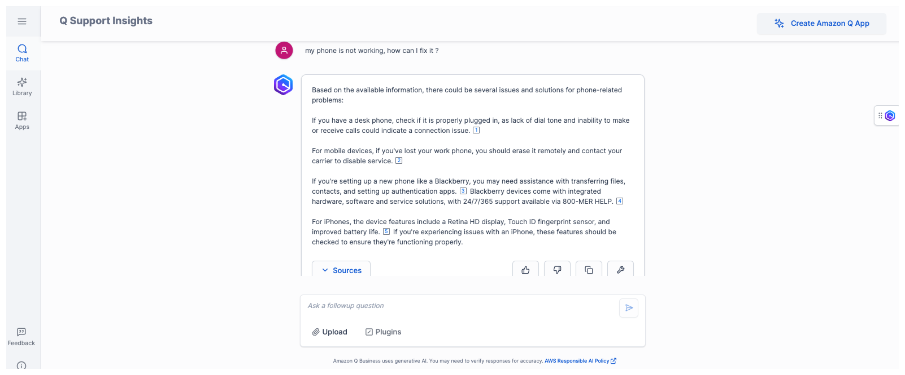

## Virtual IT Assistant powered by Amazon Q Business

The repository provides a CloudFormation template for deploying an Amazon Q Business Application with integrated data sources(ServiceNow, Confluence and JIRA) and necessary IAM roles and policies to support the application. 


### Architecture

Our solution integrates with ITSM tools like ServiceNow and project management software like Jira and Confluence using the built-in plugins for Amazon Q Business and provides the cross platform chat experience. For more information, read our blog. 




### Prerequisites and Assumptions

Please ensure that you have the following created/provisioned before deploying the Cloudformation template. 

1. An AWS Account. 
2. Amazon Q Business Lite or Pro Subcription. To read more [Q Business Pricing](https://aws.amazon.com/q/business/pricing/)
3. Configure IAM Identity Center in your AWS Account. Follow the steps later to create your Identity Center instance. Note the Identity center ARN. 
4. We are assuming that you already have a Confluence, Jira and ServiceNow account that you can use for integrating it with Amazon Q Business. If you don't, you'd need to create them. These platforms offer trials that can also be used to integrate with Amazon Q Business. We've created an [additional document that guides you to set up trials](SETUP_CONF_SNOW_JIRA.MD). 
   
   a. For integrating Confluence : 
   - Create a secret in AWS Secrets Manager for Confluence aunthentication credentials. Note the ARN of the secret. You'll require it later as an input for the Cloudformation stack. Username is your confluence User Name and password is your Atlassian API token.[To read more](https://docs.aws.amazon.com/amazonq/latest/qbusiness-ug/confluence-server-prereqs.html) 
   
   

   b. For integrating Jira :
   - Create a secret in AWS Secrets Manager for Jira aunthentication credentials. Note the ARN of the secret. You'll require it later as an input for the Cloudformation stack. Jira ID is your account User Name and Jira Credential is your Atlassian API token. [To read more](https://docs.aws.amazon.com/amazonq/latest/qbusiness-ug/jira-prereqs.html)

   
   
   c. If using the ServiceNow Online integration:
   - Create a secret in AWS Secrets Manager for ServiceNow Online aunthentication credentials. Note the ARN of the secret. You'll require it later as an input for the Cloudformation stack. Username and Password are your ServiceNow Username and Password respectively. [To read more](https://docs.aws.amazon.com/amazonq/latest/qbusiness-ug/servicenow-prereqs.html)

   

### Steps to Deploy


#### Creating an IAM Identity Center Instance

Amazon Q Business integrates with IAM Identity Center to enable managing end user access to your Amazon Q Business application. Follow these steps to create the instance - 

1. Go to IAM identity center in AWS console to enable it. 
2. Select the local instance option and enable IAM Identity center in your account. 
3. Click on Settings and copy the Instance ARN. You will need it later during the Cloudformation deployment. 


#### Deploying the Amazon Q Business Application:

1. Navigate to AWS CloudFormation in your AWS console.
2. Choose "Create stack" and select "With new resources (standard)".
3. Upload the `q-business-cfn.yaml` file as the template source. This template creates placehoders for you to add input parameters. 
4. Fill in the required parameters:

   a. Q Business Configuration:

     - Add a suitable Q Business Application Name
     - QBusinessIndexType (STARTER or ENTERPRISE)
     - Paste the IAM Identity Center ARN that you copied earlier. 

   b. For each integration (Confluence, Jira, ServiceNow):

     
     - ***For Confluence:*** Provide the ARN of the confluence secret in the relevant Existing Secret ARN field and the Host URL in the Confluence Host URL field.

     - ***For JIRA:*** Provide the ARN of the Jira secret in the relevant Existing Secret ARN field and the Host URL in the Jira Host URL field.

     - ***For ServiceNow Online:*** Provide the ARN of the ServiceNow secret in the relevant Existing Secret ARN field and the Host URL in the ServiceNow Host URL field. Also chose an instance version from the drop down list. We've used 'Vancouver' for this demo.
     
     After all the fields are added, it should appear as below - 
 

  

     
         
5. Review stack details and create the stack.

### Post Deployment Steps


#### Post-Deployment Verification of Service-Linked Role

After deploying the CloudFormation stack, verify that the AWSServiceRoleForQBusiness service-linked role exists:

 - Open the AWS IAM Console
 - Check for the Service-Linked Role
   - In the left navigation pane, select "Roles"
   - In the search box, type "AWSServiceRoleForQBusiness" and look for the role   
- If the role does not exist:
   - Click "Create role". Under "Use case", select "Q Business" as the service. Click "Next".
   - Review the permissions (AWSQBusinessServiceRolePolicy will be automatically attached)
   - Click "Create role"

Follow more: https://docs.aws.amazon.com/amazonq/latest/qbusiness-ug/security-iam-awsmanpol.html 

#### Create Users in AWS Identity Center

- To access the Amazon Q Web Application, you'd need to create an user in AWS Identity Center. Set up MFA for secured access as well. You can create this from the Q Business console as well.  
For more information: https://docs.aws.amazon.com/singlesignon/latest/userguide/addusers.html  


**💡 PRO TIP**  
*For the purposes of this demo, use the same email to create the User in AWS Identity Center that you've used to set up trial accounts for ServiceNow, Confluence and JIRA.*

#### Sync the Data Sources 

- Before starting to use the Amazon Q Business Application, you'd need to sync the data sources to crawl data from the sources and build the index. You would also need to select appropriate metadata to get more relevant responses for user queries. Read more about metadata controls https://docs.aws.amazon.com/amazonq/latest/qbusiness-ug/mapping-doc-attributes.html .







**Now that you've synced data sources and built the index, open the Web Application and start using Amazon Q Business. Happy querying!!** 



---

### Data Flow

The Amazon Q Business Application processes data from the configured integrations (Confluence, Jira, and/or ServiceNow) to provide intelligent responses and insights. Here's a high-level overview of the data flow:

1. User Authentication: Users are authenticated via IAM Identity Center.
2. Data Source Connection: The application connects to the configured data sources using the provided credentials.
3. Data Indexing: Information from the data sources is indexed within the Q Business Application.
4. Query Processing: User queries are processed against the indexed data.
5. Response Generation: The application generates responses based on the indexed data and user queries.

```
[User] <-> [IAM Identity Center]
    |
    v
[Q Business Application]
    |
    +---> [Confluence API] (if configured)
    |
    +---> [Jira API] (if configured)
    |
    +---> [ServiceNow API] (if configured)
```

Note: The actual data flow may be more complex depending on the specific configurations and AWS services involved.

### Infrastructure

The CloudFormation template (`q-business-cfn.yaml`) defines the following key resources:

- IAM Roles and Policies: For managing permissions related to the Q Business Application and its integrations.
- AWS Secrets Manager secrets: For securely storing and managing credentials for Confluence, Jira, and ServiceNow integrations.
- Amazon Q Business Application: The core application that provides the intelligent query and response functionality.
- Data Source Integrations: Configurations for connecting to Confluence, Jira, and ServiceNow (as selected during deployment).

The template uses conditions to create resources based on the parameters provided during stack creation, ensuring that only the necessary components are deployed for your specific configuration.


### Troubleshooting

Here are some of common patterns that we've encountered - 

1. IAM Identity Center not configured:
   - Error: "IAM Identity Center must be configured"
   - Solution: Set up IAM Identity Center in your AWS account before deploying this template

2. Missing required parameters:
   - Error: "Parameter 'X' must not be empty"
   - Solution: Ensure all required fields for your chosen integrations are filled out

3. Invalid secret ARNs:
   - Error: "The specified secret doesn't exist"
   - Solution: Double-check the ARN of your existing secrets and ensure they exist in the same region

For further assistance, consult AWS documentation or contact AWS support.


## Cleanup

Delete the CloudFormation stack from your AWS Account to delete the underlying resources. 


## Security

See [CONTRIBUTING](CONTRIBUTING.md#security-issue-notifications) for more information.

## License

This library is licensed under the MIT-0 License. See the [LICENSE](LICENSE.MD) file.